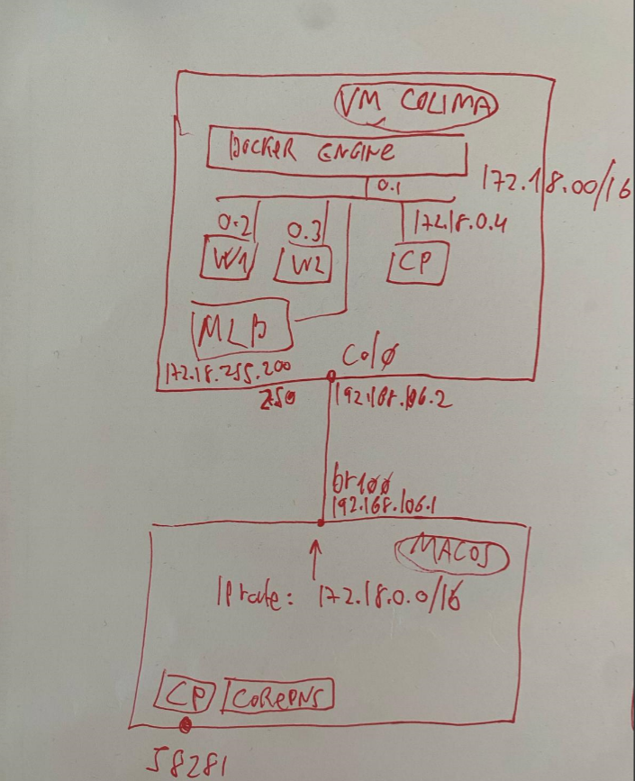

# Building a K8s cluster on macOS

### Target
This project is about setting up a k8s cluster on a macOS.

I started by [This project](https://opencredo.com/blogs/building-the-best-kubernetes-test-cluster-on-macos/) and add some components.

The cluster contains:
* a fully working k8s cluster
* matallb
* nginx ingress controller

### Setup
The final setup is a k8s cluster where the nodes are docker containers, Those nodes running inside a vm.
Colima provisions that vm, so the containers are isolated from macOS.

NOTES:
 * when issue `docker ps` on macOS, its targeting the docker-engine on Colima vm
 * the above can be verified by checking the context of `docker version`


### Steps
1. install colima
2. install docker client
3. start colima-vm
4. deploy k8s cluster with Kind on colima-vm as 3 containers (1 cp, 2 workers)
5. setup colima-vm to acceps connections from mac
6. route docker network traffic from mac to colima-vm
7. add metallb
8. add foo-bar echo app and verify load balance
9. add nginx ingress controller service with IngressClass that uses it
11. create Ingress objects (routes) for `foo-bar` and for `foo-only`

### colima (docker runtime. help running containers on macOS)
A docker runtime hosted in a vm,so containers actually running inside the vm.
note that the docker network is not on macOS.

setup colima:
  - create interface macOS:br100:192.168.106.1
  - create interface colima:col0:192.168.106.2 
  - create a route on macOS to route docker-net traffic to colima
  - allow incoming traffic from macOS:192.168.106:1 -> colima:docker-net(172.18/16)

```bash
$ brew install colima
$ colima start --network-address
$ colima list
$ sudo route -nv add -net 172.18 192.168.106.2
$ colima ssh ### this ssh to the vm. the next command should be executed inside the vm
   (colima-vm) $ sudo iptables -A FORWARD -s 192.168.106.1 -d 172.18.0.0/16 -i col0 -o br-3ca3442bb072 -p tcp -j ACCEPT
   (colima-vm) $ exit

###  if macOS restarts, need to start colima:
#  1. $ colima restart
#  2. add the route (TODO: make permanent)
#  3. add iptable (TODO: make permanent)

```
### kind
[Kind](https://kind.sigs.k8s.io/) is a tool for running local Kubernetes clusters using Docker container nodes.

```bash
$ brew install kind
$ kind create cluster --config=kind-config.yaml
```


### MetalLB : load-balancer implementation for bare metal Kubernetes

```bash
kubectl apply -f https://raw.githubusercontent.com/metallb/metallb/v0.13.9/config/manifests/metallb-native.yaml
kubectl wait --namespace metallb-system \
                --for=condition=ready pod \
                --selector=app=metallb \
                --timeout=90s
```
### deploy http services for testing
2 services: foo-bar and foo-only

```bash
$ k apply -f services.yaml
$ k get svc
NAMESPACE        NAME                                            TYPE           CLUSTER-IP      EXTERNAL-IP      PORT(S)                      AGE
default          foo-bar-service                                 LoadBalancer   10.76.144.220   172.18.255.200   5678:32611/TCP               18h
default          foo-only-service                                LoadBalancer   10.76.149.240   172.18.255.202   5678:30506/TCP               72s

$ for  x in {1..5}; do curl http://172.18.255.200:5678; done ### foo-bar
bar
foo
foo
bar
bar
$ for x in {1..5}; do curl http://172.18.255.202:5678; done ### foo-only
foo
foo
foo
foo
foo

```


### Kubeproxy
get commands from api-servers when SVC object created, and creates iptables chains to forward ports directly into pods.
to see it, you can check iptables of a node:

```bash
# login to the vm where all nodes are running as containers
$ colima ssh

  # show iptables nat rules of a node
  $ docker exec -ti chen-k8s-kind-worker iptables -nvL -t nat
```

### Ingress controler

first create the nginx-ingress-controler.
* NOTE: this is NOT the Ingress object. its the controller that used later by Ingress objects
```bash
$ kubectl create namespace ingress-nginx
$ helm repo add ingress-nginx https://kubernetes.github.io/ingress-nginx
$ helm install nginx-helm -n ingress-nginx --version=4.0.6 ingress-nginx/ingress-nginx

```
then create the Ingress object to enforce the routing:
 * foo-bar.chenk8s.test/          ->  foo-bar svc
 * foo-bar.chenk8s.test/foo-only  ->  foo-only svc

```bash
$ kubectl apply -f ingress-foo-bar.yaml 
```

### Verify:
see below some tests

```bash
# after adding 172.18.255.201:foo-bar.chenk8s.test to /etc/hosts
$ curl http://foo-bar.chenk8s.test
bar
$ curl http://foo-bar.chenk8s.test/foo-only
foo

# this is directly from metallb -> foo-bar-svc (200)
$ curl http://172.18.255.200:5678

# via ingress controller: 
# metallb -> ing-ctrl-svc (201) -> [ingress routing] -> foo-bar-service
$ for x in {1..5}; do curl --resolve foo-bar.chenk8s.test:80:172.18.255.201 http://foo-bar.chenk8s.test; done
bar
foo
foo
bar
bar

# metallb -> ing-ctrl-svc (201) -> [ingress routing] -> foo-only-service
$ for x in {1..5}; do curl --resolve foo-bar.chenk8s.test:80:172.18.255.201 http://foo-bar.chenk8s.test/foo-only; done   
foo
foo
foo
foo
foo

```


### extras
dynamic dns resolving ?
annotations ?


### Links and resources:
* [building-the-best-kubernetes-test-cluster-on-macos](https://opencredo.com/blogs/building-the-best-kubernetes-test-cluster-on-macos/)
* [Cracking Kubernetes Node Proxy (aka kube-proxy)](https://arthurchiao.art/blog/cracking-k8s-node-proxy/)
* [Nginx vs. Traefik vs. HAProxy: Comparing Kubernetes Ingress Controllers](https://loft.sh/blog/nginx-vs-traefik-vs-haproxy-comparing-kubernetes-ingress-controllers/)
* [Ingress-Nginx Controller - Basic usage - host based routing](https://kubernetes.github.io/ingress-nginx/user-guide/basic-usage/)

